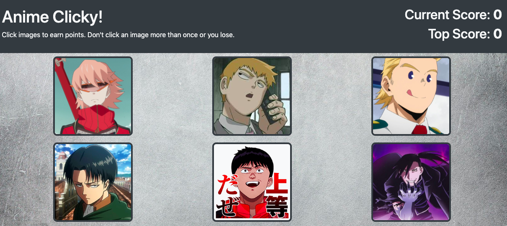

# clicky

## Live Link
https://petewanca.github.io/clicky/

## Contributors
@petewanca

## Technology
- React
- JavaScript

## About
An anime-themed memory game. Choose cards, but only click them once. If you click a card more than one time, you lose. Try to select all cards!

  

## License
This project is licensed under The MIT License (MIT).

## Contributing Guidelines
All contributions and suggestions are welcome! For direct contributions, please fork the repository and file a pull request.

## Contact
- Name: Pete Wanca (@petewanca)
- Role: Full Stack Developer
- Email: petewanca@gmail.com
- LinkedIn: https://www.linkedin.com/in/petewanca/
